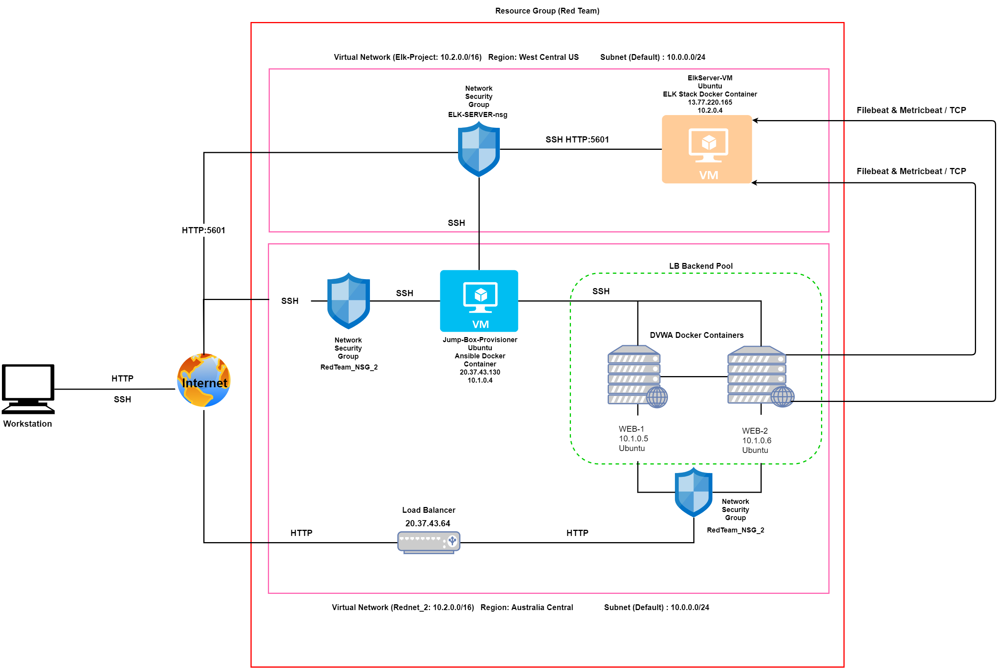

# ELK-Stack-Project
## Automated ELK Stack Deployment

The files in this repository were used to configure the network depicted below.
 


These files have been tested and used to generate a live ELK deployment on Azure. They can be used to either recreate the entire deployment pictured above. Alternatively, select portions of the YML file may be used to install only certain pieces of it, such as Filebeat.

 #### Playbook 1: pentest.yml
```
---
- name: Config Web VM with Docker
  hosts: webservers
  become: true
  tasks:
  - name: docker.io
    apt:
      force_apt_get: yes
      update_cache: yes
      name: docker.io
      state: present

  - name: Install pip3
    apt:
      force_apt_get: yes
      name: python3-pip
      state: present

  - name: Install Docker python module
    pip:
      name: docker
      state: present

  - name: download and launch a docker web container
    docker_container:
      name: dvwa
      image: cyberxsecurity/dvwa
      state: started
      published_ports: 80:80

  - name: Enable docker service
    systemd:
      name: docker
      enabled: yes
```
 
       
#### Playbook 2: Elk_VM_Playbook.yml
```
---
- name: Configure Elk VM with Docker
  hosts: ELK
  become: true
  tasks:
    # Use apt module
    - name: Install docker.io
      apt:
        update_cache: yes
        force_apt_get: yes
        name: docker.io
        state: present

    # Use apt module
    - name: Install python3-pip
      apt:
        force_apt_get: yes
        name: python3-pip
        state: present

    # Use pip module (It will default to pip3)
    - name: Install Docker module
      pip:
        name: docker
        state: present

    # Use command module
    - name: Increase virtual memory
      command: sysctl -w vm.max_map_count=262144

    # Use sysctl module
    - name: Use more memory
      sysctl:
        name: vm.max_map_count
        value: 262144
        state: present
        reload: yes

    # Use docker_container module
    - name: download and launch a docker elk container
      docker_container:
        name: elk
        image: sebp/elk:761
        state: started
        restart_policy: always
        # Please list the ports that ELK runs on
        published_ports:
          -  5601:5601
          -  9200:9200
          -  5044:5044

    #systemd
    - name: Enable docker service
      systemd:
        name: docker
        enabled: yes
```

#### Playbook 3: filebeat_playbook.yml
```
---
- name: installing and launching filebeat
  hosts: webservers
  become: yes
  tasks:

  - name: download filebeat deb
    command: curl -L -O https://artifacts.elastic.co/downloads/beats/filebeat/filebeat-7.6.1-amd64.deb

  - name: install filebeat deb
    command: dpkg -i filebeat-7.6.1-amd64.deb

  - name: drop in filebeat.yml
    copy:
      src: /etc/ansible/files/filebeat-config.yml
      dest: /etc/filebeat/filebeat.yml

  - name: enable and configure system module
    command: filebeat modules enable system

  - name: setup filebeat
    command: filebeat setup

  - name: Start filebeat service
    command: service filebeat start

  - name: Enable filebeat service
    systemd:
       name: filebeat
       enabled: yes
```
This document contains the following details:
- Description of the Topology
- Access Policies
- ELK Configuration
  - Beats in Use
  - Machines Being Monitored
- How to Use the Ansible Build


### Description of the Topology

The main purpose of this network is to expose a load-balanced and monitored instance of DVWA, the D*mn Vulnerable Web Application.

Load balancing ensures that the application will be highly available, in addition to restricting access to the network.
- The load balancer protects the network from DDoS attacks (denial of service) and helps to distribute the traffic between the servers. Addiontionally, it assists with preventing intruders by restricting access to the servers hosting the application.
- A jump box is an admin workstation used to conduct administrative tasks in the network securely and allows admins to access the other servers to monitor and manage the environment.

Integrating an ELK server allows users to easily monitor the vulnerable VMs for changes to the logs and system traffic.
- What does Filebeat watch for? 
  - Filebeat watches for changes log files and locations and collects and send log events to logstash/elasticsearch
  
- What does Metricbeat record? 
  - Metricbeat collects and records metrics and statistical data from the services and operating system running on the server and sends the data to logstash/elasticsearch

The configuration details of each machine may be found below.

| Name       | Function                       | IP Address | Operation System |
|------------|--------------------------------|------------|------------------|
| Jumpbox    | Gateway with ansible container | 10.1.0.4   | Linux 20_04-lts  |
| Web-1      | Web Server Docker DVWA         | 10.1.0.5   | Linux 18.04-LTS  |
| Web-2      | Web Server Docker DVWA         | 10.1.0.6   | Linux 18.04-LTS  |
| ELK Server | ELK Stack Container            | 10.2.0.4   | Linux 18.04-LTS  |

### Access Policies

The machines on the internal network are not exposed to the public Internet. 

Only the Jump Box Provisioner machine can accept connections from the Internet. Access to this machine is only allowed from the following IP addresses:
 
 - Workstation IP address 

Machines within the network can only be accessed by the Jump box.
- The ELK Server can be accessed from the Workstation IP Address through port 5601

A summary of the access policies in place can be found in the table below.

| Name       | Publicly Accessible | Allowed IP Addresses |
|------------|---------------------|----------------------|
| Jump Box   | Yes                 | Personal             |
| Web-1      | No                  | 10.1.0.5             |
| Web-2      | No                  | 10.1.0.6             |
| ELK Server | Yes                 | Personal             |

### Elk Configuration

Ansible was used to automate configuration of the ELK machine. No configuration was performed manually, which is advantageous because we are able to automate the installation on multiple servers easily and quickly without having to access each server manually. The services running can be limited, system installations and updates can be more efficient and would save alot of time.

The playbook implements the following tasks:
- Installs Docker.io, pip3, Docker module.
```
---
  - name: docker.io
    apt:
      force_apt_get: yes
      update_cache: yes
      name: docker.io
      state: present

  - name: Install pip3
    apt:
      force_apt_get: yes
      name: python3-pip
      state: present

  - name: Install Docker python module
    pip:
      name: docker
      state: present

```
- Increases virtual memory for the VM running ELK and uses Sysctl Module
```
---
    # Use command module
    - name: Increase virtual memory
      command: sysctl -w vm.max_map_count=262144

    # Use sysctl module
    - name: Use more memory
      sysctl:
        name: vm.max_map_count
        value: 262144
        state: present
        reload: yes

```
- Downloads and launches the docker elk container
```
---
    # Use docker_container module
    - name: download and launch a docker elk container
      docker_container:
        name: elk
        image: sebp/elk:761
        state: started
        restart_policy: always
        # Please list the ports that ELK runs on
        published_ports:
          -  5601:5601
          -  9200:9200
          -  5044:5044

    #systemd
    - name: Enable docker service
      systemd:
        name: docker
        enabled: yes

```

The following screenshot displays the result of running `docker ps` after successfully configuring the ELK instance.

**Note**: The following image link needs to be updated. Replace `docker_ps_output.png` with the name of your screenshot image file.  


### Target Machines & Beats
This ELK server is configured to monitor the following machines:
- _TODO: List the IP addresses of the machines you are monitoring_

We have installed the following Beats on these machines:
- _TODO: Specify which Beats you successfully installed_

These Beats allow us to collect the following information from each machine:
- _TODO: In 1-2 sentences, explain what kind of data each beat collects, and provide 1 example of what you expect to see. E.g., `Winlogbeat` collects Windows logs, which we use to track user logon events, etc._

### Using the Playbook
In order to use the playbook, you will need to have an Ansible control node already configured. Assuming you have such a control node provisioned: 

SSH into the control node and follow the steps below:
- Copy the _____ file to _____.
- Update the _____ file to include...
- Run the playbook, and navigate to ____ to check that the installation worked as expected.

_TODO: Answer the following questions to fill in the blanks:_
- _Which file is the playbook? Where do you copy it?_
- _Which file do you update to make Ansible run the playbook on a specific machine? How do I specify which machine to install the ELK server on versus which to install Filebeat on?_
- _Which URL do you navigate to in order to check that the ELK server is running?

_As a **Bonus**, provide the specific commands the user will need to run to download the playbook, update the files, etc._
